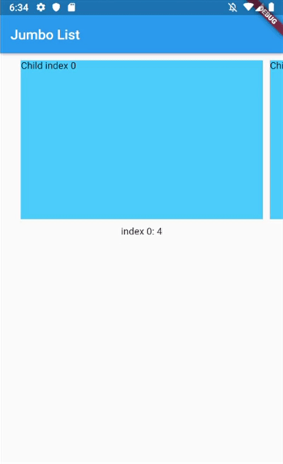

# scroll_snap_list

A wrapper for `ListView.builder` widget that allows "snaping" event to an item at the end of user-scroll.

This widget allows unrestricted scrolling (unlike other widget that only able to "snap" to left/right neighbor at a time).
- Support horizontal & vertical list
- Use `ListView.Builder`, means no Animation

You can use this widget to achieve:
- Scrollable InputSelect, like datetime picker in cupertino
- Show daily entry for Health App and shows its detail directly below the list (reduce number of click)

||||
|-----|-----|-----|
|Horizontal Jumbotron List|Simple Horizontal List|Vertical list with InkWell ListItems|

## Getting Started
In your flutter project `pubspec.yaml` add the dependency:
```yaml
dependencies:
  ...
  scroll_snap_list: ^0.1.0
```

## Usage example
This library doesn't use other library, so it should work out of the box.

Import `scroll_snap_list.dart`.

```dart
import 'package:scroll_snap_list/scroll_snap_list.dart';
```

Add `ScrollSnapList` in your `build` method. Make sure to enter correct `itemSize` (helps with "snapping" process).
```dart
Expanded(
  child: ScrollSnapList(
    onItemFocus: _onItemFocus,
    itemSize: 35,
    buildListItem: _buildListItem,
    itemCount: data.length,
    reverse: true,
  ),
),
```

Full example:
```dart
import 'dart:math';

import 'package:flutter/material.dart';
import 'package:scroll_snap_list/scroll_snap_list.dart';

void main() => runApp(HorizontalListDemo());

class HorizontalListDemo extends StatefulWidget {
  @override
  _HorizontalListDemoState createState() => _HorizontalListDemoState();
}

class _HorizontalListDemoState extends State<HorizontalListDemo> {
  List<int> data = [];
  int _focusedIndex = 0;

  @override
  void initState() {
    super.initState();

    for (int i = 0; i < 30; i++) {
      data.add(Random().nextInt(100) + 1);
    }
  }

  void _onItemFocus(int index) {
    setState(() {
      _focusedIndex = index;
    });
  }

  Widget _buildItemDetail() {
    if (data.length > _focusedIndex)
      return Container(
        height: 150,
        child: Text("index $_focusedIndex: ${data[_focusedIndex]}"),
      );

    return Container(
      height: 150,
      child: Text("No Data"),
    );
  }

  Widget _buildListItem(BuildContext context, int index) {
    //horizontal
    return Container(
      width: 35,
      child: Column(
        mainAxisAlignment: MainAxisAlignment.end,
        children: <Widget>[
          Container(
            height: data[index].toDouble()*2,
            width: 25,
            color: Colors.lightBlueAccent,
            child: Text("i:$index\n${data[index]}"),
          )
        ],
      ),
    );
  }

  @override
  Widget build(BuildContext context) {
    return MaterialApp(
      title: 'Horizontal List Demo',
      home: Scaffold(
        appBar: AppBar(
          title: Text("Horizontal List"),
        ),
        body: Container(
          child: Column(
            children: <Widget>[
              Expanded(
                child: ScrollSnapList(
                  onItemFocus: _onItemFocus,
                  itemSize: 35,
                  buildListItem: _buildListItem,
                  itemCount: data.length,
                  reverse: true,
                ),
              ),
              _buildItemDetail(),
              Row(
                mainAxisAlignment: MainAxisAlignment.spaceEvenly,
                children: <Widget>[
                  RaisedButton(
                    child: Text("Add Item"),
                    onPressed: () {
                      setState(() {
                        data.add(Random().nextInt(100) + 1);
                      });
                    },
                  ),
                  RaisedButton(
                    child: Text("Remove Item"),
                    onPressed: () {
                      int index = data.length > 1
                          ? Random().nextInt(data.length - 1)
                          : 0;
                      setState(() {
                        data.removeAt(index);
                      });
                    },
                  ),
                ],
              )
            ],
          ),
        ),
      ),
    );
  }
}
```

## Other Notice
By default, `SnapScrollList` set `focusOnItemTap` as `true`. Means any tap event on items will trigger snap/focus event to that item.

This behavior use `GestureDetector`, so if the list's items have their own detector (e.g. InkWell, Button), `SnapScrollList` unable to trigger snap event on its own. To handle this, we may use `GlobalKey<ScrollSnapListState>` to trigger the event manually.

Add `GlobalKey<ScrollSnapListState>` in your widget
```dart
GlobalKey<ScrollSnapListState> sslKey = GlobalKey();
```

Add `key` parameter to `SnapScrollList`.
```dart
ScrollSnapList(
  onItemFocus: _onItemFocus,
  itemSize: 50,
  buildListItem: _buildListItem,
  itemCount: data.length,
  key: sslKey,
  scrollDirection: Axis.vertical,
)
```

In your `buildItem` method, call `focusToItem` method.
```dart
Widget _buildListItem(BuildContext context, int index) {
  //horizontal
  return Container(
    height: 50,
    child: Material(
      color: _focusedIndex == index ? Colors.lightBlueAccent : Colors.white,
      child: InkWell(
        child: Text("Index: $index | Value: ${data[index]}"),
        onTap: () {
          print("Do anything here");

          //trigger focus manually
          sslKey.currentState.focusToItem(index);
        },
      ),
    ),
  );
}
```

Full example for this part can be found in `example/vertical_list.dart`.